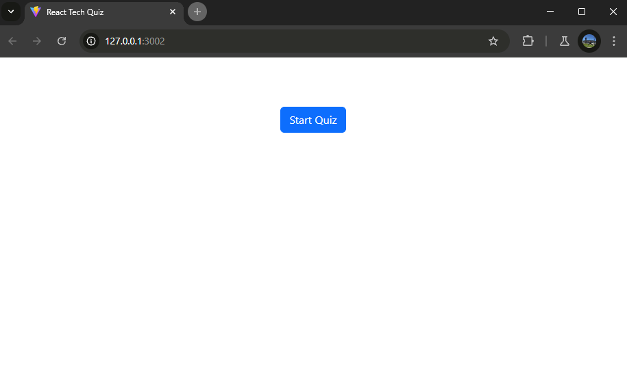
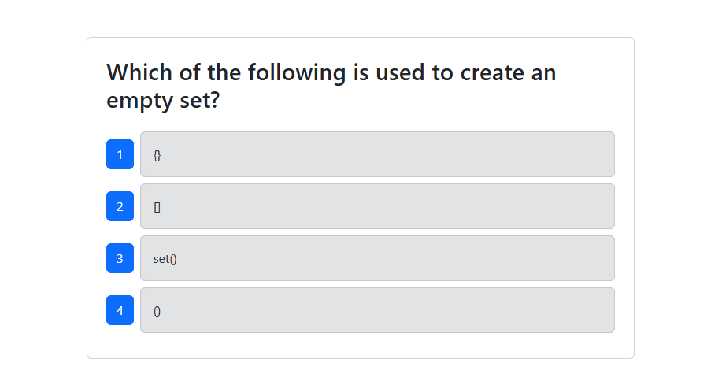
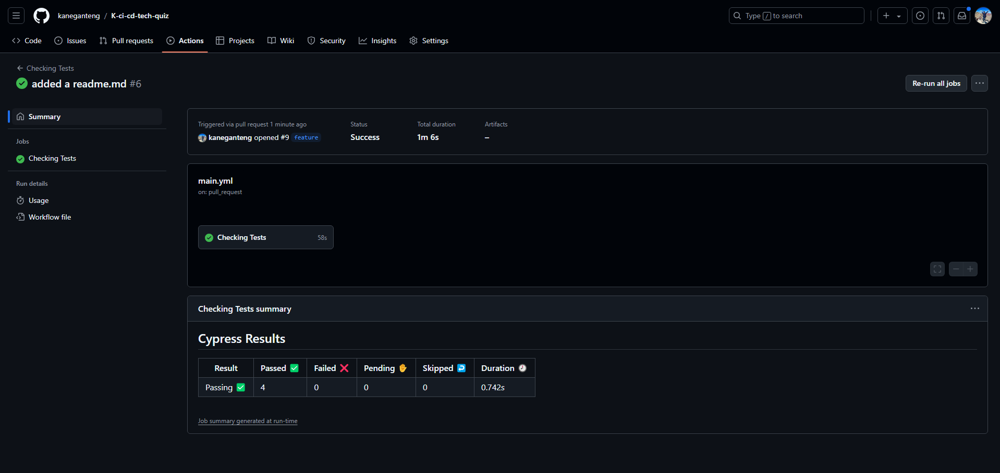
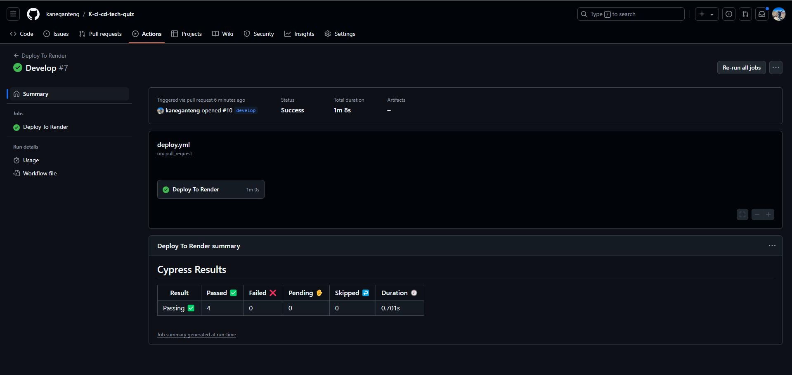

# K-ci-cd-tech-quiz
  
  ## Description
  The purpose of this repository is to do a Continuous Integration and Continuous Delivery (CI/CD) on the Python Tech Quiz application. After having the repository go through changes, it should automatically be deployed to render with the help of deploy.yml and main.yml file.
  ## Table of Contents
  * [Installation](#installation)
  * [Usage](#usage)
  * [Credits](#credits)
  * [License](#license)
  * [Badges](#badges)
  * [Features](#features)
  * [How to Contribute](#howToContribute)
  * [Test](#test)
  ## Installation
  This application will be available on github. Copying the SSH link and do a `git clone` on the terminal will clone this repository. 
  Once the code is opened on the local device, open a terminal and do `npm install` `npm run build` `npm run seed` and `npm run start:dev`.
  This application will also be accesible through the deployed link on render that is attached at the end of this README.md.
  ## Usage
  `npm install`  
  `npm run build`  
  `npm run seed` 
  `npm run start:dev` 
  in order to test the code first: 
  `npm run test`   
  
  ## GitHub Actions
  * GitHub Actions tests:   
    
  * GitHub Actions deployments:  
  
  ## Credits
  N/A
  ## License
  MIT 
  ## Badges
  N/A
  ## Features
  * React
  * TypeScript
  * Node.js
  * Express.js
  * MongoDB database
  * Cypress

  ## How to Contribute
  You can reach out to me on the
  ## Deployed Application Link
  [HERE FOR THE DEPLOYED WEB APP](https://k-ci-cd-tech-quiz.onrender.com)
  ## Questions
  Contact:
  * Name: Kane Esasta
  * Email: kaneesasta@gmail.com
  * Github: [kaneganteng](https://github.com/kaneganteng)
